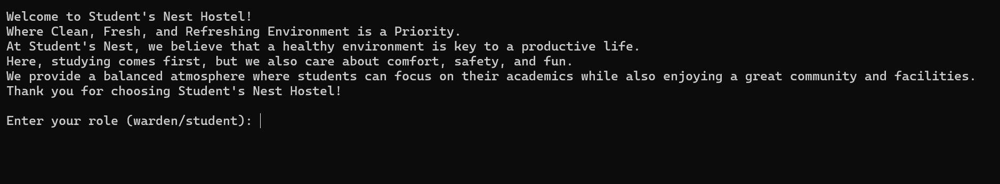
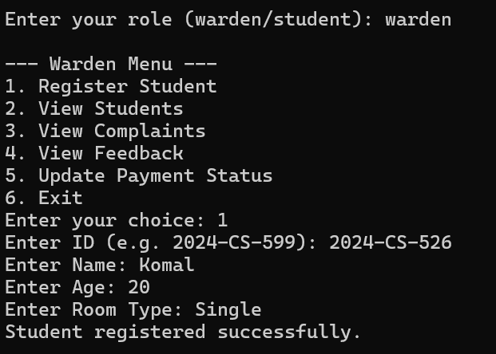
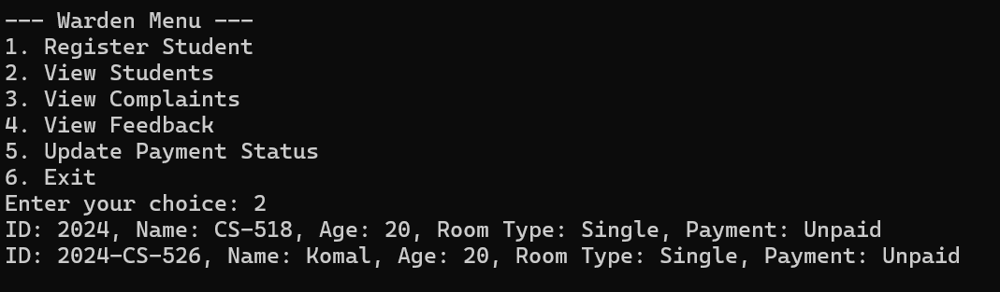
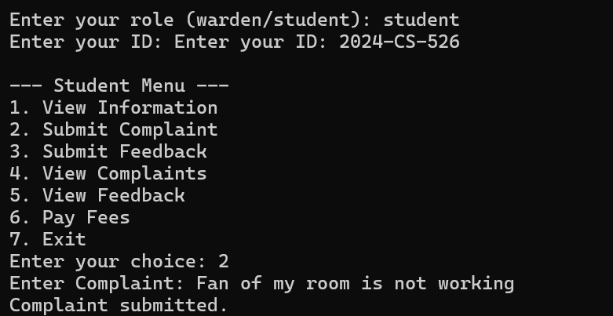
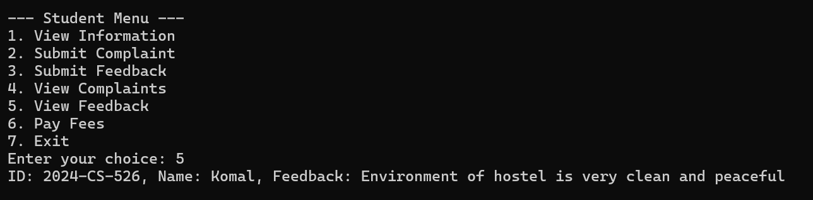
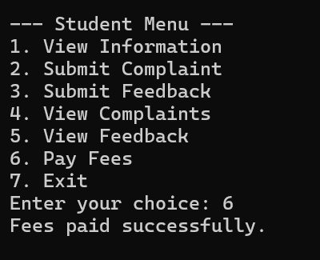

# 🏠 Student's Nest — Hostel Management System

> A console-based C++ hostel management system designed to simplify student record management, fee tracking, complaints, and feedback through dedicated **Warden** and **Student** interfaces.

<p align="center">
  
</p>

---

## 📌 About The Project

**Student's Nest Hostel Management System** is a C++ console application developed to demonstrate the practical use of programming fundamentals and file handling in a real-world hostel management scenario.

The system provides separate workflows for **Wardens** and **Students**, allowing hostel staff to manage student records and payment status while enabling students to view their information, submit complaints, provide feedback, and manage their fee payments.

Student data is stored persistently using **file handling**, allowing records to remain available after the application is closed and reopened.

This project was built as a practical application of C++ programming concepts and problem-solving skills.

---

## ✨ Key Features

### 👨‍💼 Warden Management

Wardens can:

* 📝 Register new students
* 👥 View registered student records
* 💰 View and update student payment status
* 📢 Review student complaints
* 💬 View student feedback
* 📊 Monitor basic hostel records

### 🎓 Student Portal

Students can:

* 👤 View their personal hostel information
* 📝 Submit complaints
* 💬 Submit feedback
* 📢 View submitted complaints
* 💭 View feedback records
* 💰 Pay hostel fees
* 🔄 Check payment status

### 💾 Persistent Data Storage

The application uses C++ file handling to save and load student records using a `students.txt` file.

This means student information can persist between program sessions rather than being lost when the application closes.

---

## 🖥️ Application Screenshots

### 🏠 Welcome Screen

<p align="center">
  
</p>>

---

### 👨‍💼 Warden Menu

The Warden interface provides access to student registration, student records, complaints, feedback, and payment management.

<p align="center">
  
</p>

---

### 👥 Student Records

Wardens can view registered students along with their basic information and payment status.

<p align="center">
  
</p>

---

### 📝 Student Complaint

Students can submit complaints through the student interface, which can then be reviewed by the warden.

<p align="center">
  
</p>

---

### 💬 Feedback Management

The system allows hostel management to view feedback submitted by students.

<p align="center">
  
</p>

---

### 💰 Fee & Payment Management

Students can pay their hostel fees, while wardens can update and monitor payment status.

<p align="center">
  
</p>

---

## 🛠️ Technologies & Concepts

### Programming Language

* **C++**

### Core Concepts Used

* 📦 Structures (`struct`)
* 🔢 Arrays
* 🔄 Loops
* 🔀 Conditional Statements
* 🧩 Functions
* 📂 File Handling
* 📝 Input & Output Streams
* 🎯 Role-Based Menu Logic
* 💾 Persistent Data Storage

### C++ Libraries

* `<iostream>` — Console input and output
* `<fstream>` — File handling and persistent storage
* `<string>` — String manipulation

---

## 🏗️ Project Structure

```text
Student's-Nest-Hostel-Management-System/
│
├── HostelManagementSystem.cpp
├── README.md
│
└── screenshots/
    ├── welcome.png
    ├── warden-menu.png
    ├── view-students.png
    ├── student-complaint.png
    ├── view-feedback.png
    └── payment.png
```

The application automatically uses a `students.txt` file to store student information when the program is executed.

---

## ⚙️ How to Run

### 1️⃣ Clone the Repository

```bash
git clone https://github.com/Komal-Sharafat-518/Hostel-Management-System.git
```

### 2️⃣ Navigate to the Project Directory

```bash
cd Hostel-Management-System
```

### 3️⃣ Compile the Program

Using a C++ compiler such as `g++`:

```bash
g++ HostelManagementSystem.cpp -o HostelManagementSystem
```

### 4️⃣ Run the Application

**Windows:**

```bash
HostelManagementSystem.exe
```

**Linux / macOS:**

```bash
./HostelManagementSystem
```

---

## 🔄 How It Works

The system provides two primary user roles:

```text
                    🏠 Student's Nest
                          │
             ┌────────────┴────────────┐
             │                         │
       👨‍💼 Warden                  🎓 Student
             │                         │
     ┌───────┼───────┐         ┌───────┼───────┐
     │       │       │         │       │       │
  Manage  Complaints Payment  View   Submit   Pay
 Students  & Feedback Status   Info  Feedback Fees
             │                         │
             └──────────┬──────────────┘
                        │
                 💾 students.txt
                  Persistent Data
```

---

## 🧠 What I Learned

Building this project helped strengthen my understanding of:

* Designing menu-driven console applications
* Using structures to organize related data
* Working with arrays to manage multiple records
* Breaking application logic into reusable functions
* Reading and writing data using file streams
* Implementing role-based workflows
* Managing application state and user input
* Translating a real-world management problem into a software solution

---

## 🚀 Future Improvements

Possible improvements for future versions include:

* 🔐 Secure authentication for students and wardens
* 🗄️ Database integration using MySQL or PostgreSQL
* 🖥️ Graphical User Interface (GUI)
* 🏠 Room availability and allocation management
* 📊 Hostel occupancy dashboard
* 🔎 Advanced student search and filtering
* ✏️ Edit and delete student records
* 📱 Online fee payment integration
* 📧 Automated email notifications
* 📈 Reports and analytics for hostel management

---

## 🎯 Project Purpose

This project was created as a practical C++ application to strengthen programming fundamentals and explore how software can be designed to address real-world management problems.

Although developed as a console application, the project provides a foundation that could be expanded into a full-scale hostel management platform with a database, authentication, GUI, and online services.

---

## 👩‍💻 Author

### **Komal Sharafat**

🎓 BS Computer Science Student
💻 Software Development Enthusiast
🤖 Exploring AI Automation

I'm passionate about learning, building practical projects, and exploring how software and emerging technologies can solve real-world problems.

---

<p align="center">
  ⭐ If you found this project interesting, consider giving the repository a star!
</p>

<p align="center">
  <b>Built with C++ and curiosity 🚀</b>
</p>

